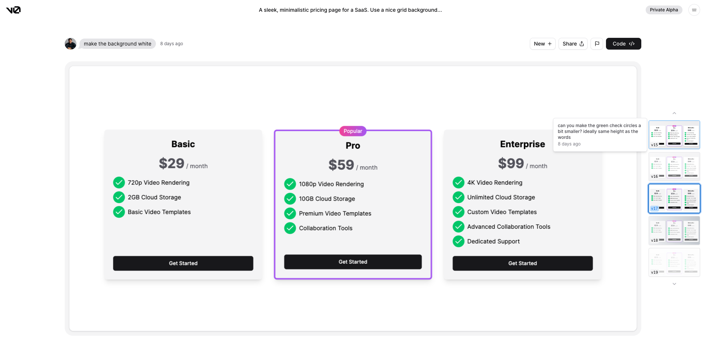

Vercel が自然言語から UI を生成する「v0」を実験的に公開した。

https://www.publickey1.jp/blog/23/verceluiv0tailwind_cssshadcn_ui.html

なので、試してみるー。

<!--truncate-->

まずは開く。

https://v0.dev/


試しに EC サイトのトップページの UI を作ってもらおう。
題材は、「コーヒー豆を売る EC サイト」。

とりあえずページ開いて出てきたチャット欄に「Top page of e-commerce site selling coffee beans」と打ってみる。

Vercel へのログインが必要みたいだ。ログインページに遷移した。

ログインしたら同じチャット欄が出てきたので今度こそ。

そしたら、 `v0 is currently in private alpha
Join the waitlist to become one of the first to experience the private beta for v0.` との表記が。private alpha 版なので、waitlist はあって当然か。
「Join waitlist」のボタンをクリックして、今日は終了（笑）

何だか味気ないので、みんなの例を覗いてみる。

https://v0.dev/t/rRBlufM

これすごい。チャットだけで作った UI とは思えない。



しかも、右側の version ごとの画像にフォーカスを当てると、どんな文言でチャットを送ったかが確認できる。これは参考にできそう。

Code を押すと UI を示すコードが確認できる。試しにコピーして自分の NextJS のアプリで使ってみたけど、ちゃんと再現されている。マジですごい。

うわー、自分自身で早く試したい。Docs には、

- v0 の紹介
- v0 を使ったコード生成方法
- アプリケーションとの統合

などが書いてある。

https://v0.dev/docs

デザインは Tailwind CSS と shadcn/ui がベースとなっているらしい。後者は初めて聞いたけど、コンポーネントのライブラリで、ここにあるコンポーネントを使うだけで、いい感じのデザインの UI 作成が簡単にできそう。いいこと知った。
UI 経由で生成したコードを使う方法はシンプルにコピー&ペースト。CLI 経由でもできるらしい。すご。

```
$ npx v0@latest add E0aXCzs
```

と打ってみる。 `E0aXCzs` の部分は公開されているサンプルの ID。多分 params の ID だと思う。

```
$ npx v0@latest add E0aXCzs
Need to install the following packages:
  v0@0.0.5
Ok to proceed? (y) y
Configuration is missing. Please run the following command to create a components.json file.

 npx v0@latest init
```

と表示されたので、 `npx v0@latest init` を実行してみると、

```components.json
{
  "$schema": "https://ui.shadcn.com/schema.json",
  "style": "new-york",
  "rsc": true,
  "tsx": true,
  "tailwind": {
    "config": "tailwind.config.js",
    "css": "src/app/globals.css",
    "baseColor": "zinc",
    "cssVariables": false
  },
  "aliases": {
    "utils": "@/lib/utils",
    "components": "@/components"
  }
}
```

が生成された。

そして再度リベンジ。

```src/components/component.tsx
/**
 * This code was generated by v0 by Vercel Labs.
 * @see https://v0.dev/t/E0aXCzs
 */
import { Button } from "@/components/ui/button"

export function Component() {
return (export default function Component() {
  return (
    <section className="min-h-screen w-full py-12 bg-gradient-to-br from-zinc-100 to-zinc-200 dark:from-zinc-800 dark:to-zinc-900 flex items-center justify-center">

    // 省略

    </section>
  )
}
)
}
```

少し間違ったコードだったけど、すぐに手直ししたら、すぐにコンポーネントとして利用できた。

`components.json` は config っぽいと思ったけど、やっぱり config だった。コードが生成される場所などを指定できる。オプション全ての説明は一旦見ない。

UI 経由でコピー&ペーストした時と違って、コンポーネントとして切り出されていた Button までもがちゃんと生成された。素晴らしすぎる。

本番環境に利用する際は、アクセシビリティやセキュリティのチェックは自分で行う必要が当然あるが、こんな簡単に UI が生成できたら最高だ。

個人開発がより捗りそう。デザインができなくてもページ遷移だけ考えれば、あとは UI を生成してもらって開発できる。

先ほどのようなコンポーネントだけでなく、一覧画面も作れそう（実際にサンプルが存在する）。きっとプロンプトに一定気を使う必要はあるが、だとしてもこれは本当にすごい。最高だ。

出来上がるコードは一気に 1000 行を超えてくることもある。責務で分割されていないので、運用を見据えるとこのままだときつい。人間がちゃんと読みやすいように整えてあげる必要がある。
ChatGPT に分割してもらうのも一つの手だが、チャンクの制限があるから大きいと考え物だ。
