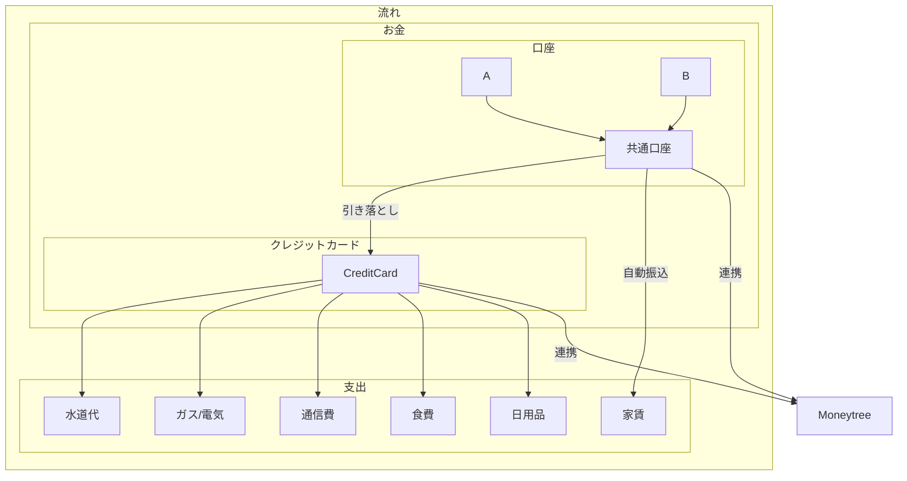
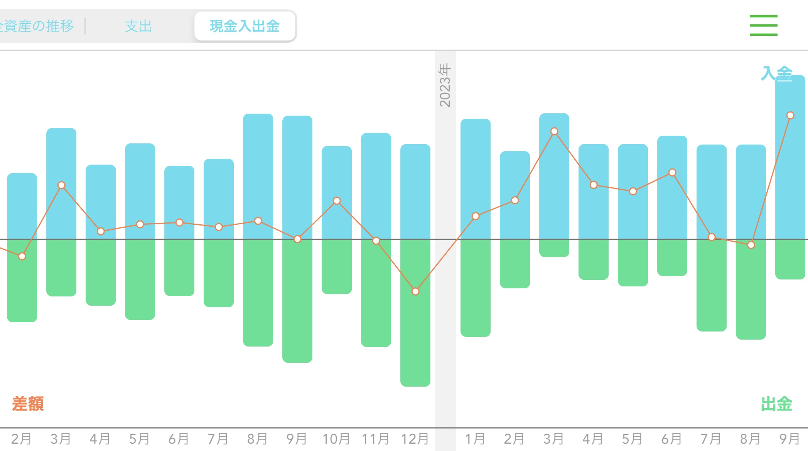

つい最近我が家で実践している家計の管理方法が褒められたので、公開してみる。

<!--truncate-->

ざっくりこんな感じだ。

これで、生活費を共通口座へ送金 ~ 家計の可視化までが自動化される。

## 1. 共通口座への送金

一人暮らしなら、可視化も簡単だ。自分だけの口座を考えればいい。が、二人以上世帯を共にしていると、そうではない。何かに連携するとしても複数の口座を連携しなければいけないし、一元化されないのでお金の出入りが明確ではない部分が多数出てくる。そうなると家計がコントロールできない存在になってくる。

なので、まずは一元化を行う。

定額引き落とし機能が存在するネット銀行を共通の口座として扱うことで、まず家計管理の対象を一つにする。他にも、固定費の多様な支払い方法に対応できるように **自動振込機能** があるネット銀行だと、なお良い。

家からの支出を整理すると

- 家賃
- 通信費
- 電気
- ガス
- 水道
- 食費
- 日用品

は、毎月の出費がある。

なので、これらの支払いを行うにあたって、現金を使わない方法を考えると、自動振込機能は必須だ。クレジットカード払いが対応していない支出が一つは存在する可能性が高い。特に家賃。クレジットカード払いができる物件に住むことができればいいが、まだまだ家賃を振込まなければいけない物件は多い。ちなみに我が家の場合はこうだった。

|            | 振込 | 口座振替 | クレジットカード払い | 請求書払い | 現金 | スマホ決済 |
| ---------- | ---- | -------- | -------------------- | ---------- | ---- | ---------- |
| 家賃       | ○    |          |                      |            |      |            |
| 通信       |      | ○        | ○                    | ○          |      |            |
| 電気・ガス |      | ○        | ○                    | ○          |      |            |
| 水道       |      | ○        | ○                    | ○          |      | ○          |
| 食費       |      |          | ○                    |            | ○    | ○          |
| 日用品     |      |          | ○                    |            | ○    | ○          |

こうみると、支払い方法って多いなー。
一元化するネット銀行が決まれば、もうあとはどう自動化していくかを考えるだけ。

## 2. 支払い

一元化した口座を引き落とし口座と設定したクレジットカードもしくは自動振込で基本的には支払いを済ませる。これを徹底する。

こうすることで、支払いの情報が後述するアプリに自動連携される。

どのクレジットカードにするかは、一定議論の余地があるので、比較検討してみてほしい。

デメリットは、現金でのみ支払い可能なお店には行けない（笑）。

まあ結局たまにはいくこともあるので、そこは少しずつ帳尻を合わせるようにする。ただ、便利な世の中になったので、近くのラーメン屋さんでも Edy だったり iD を使えることは多い。なので、あまりデメリットと感じたことはない。
住む場所に恵まれた。

## 3. 可視化

moneytree さんにお世話になっている。こんな感じだ。

入金・出金・差額が一目でわかるのと、詳細も確認が容易だ。
moneyforward と比較検討したが、支払い情報におけるカテゴリの自動振り分けが、感覚的に moneytree の方が合っているように感じた。ここは好みの問題で、どちらも良いサービスなのは間違いない。

## まとめ

少しの工夫で、労力が 0 の家計管理方法を紹介した。

口座やクレジットカード、アプリの設定を行い、支払い方法をクレジットカードに徹底することで、一発で何にどれくらい使ったかがわかるようになった。
お金がたまらないって人は、まず可視化から始めてみては。

また、この仕組みを構築した際の思考もいつかまとめたい。
