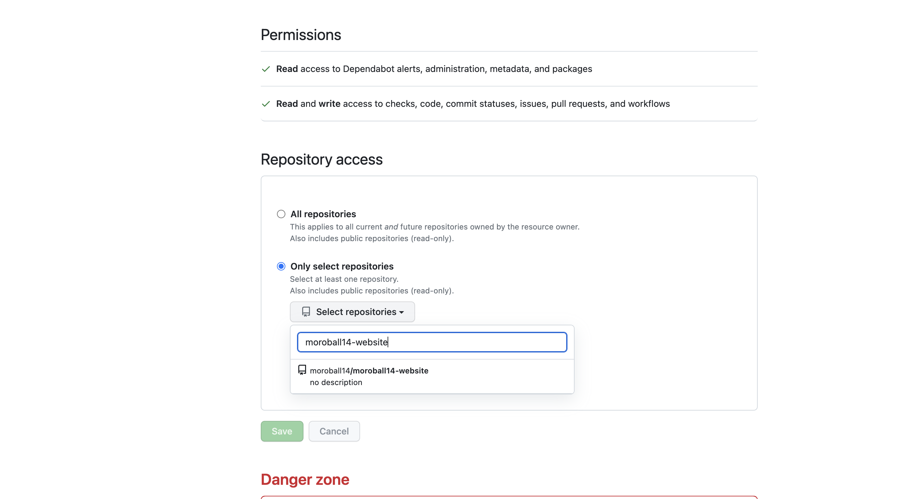
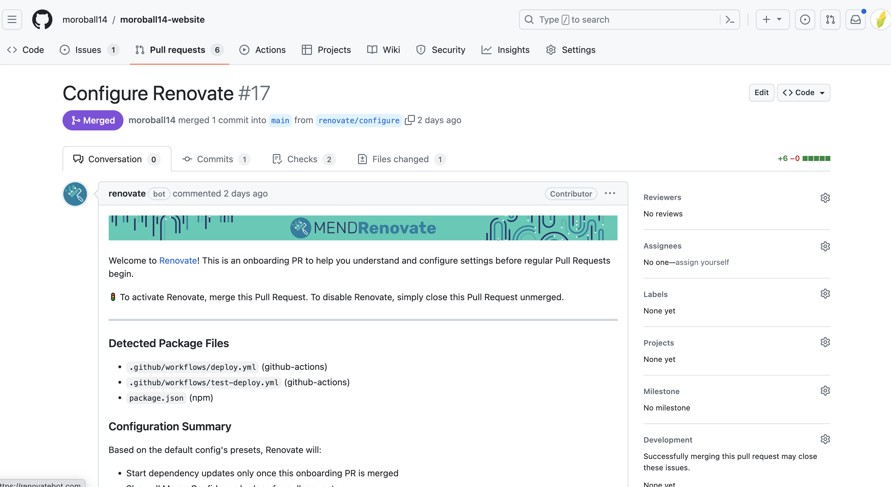
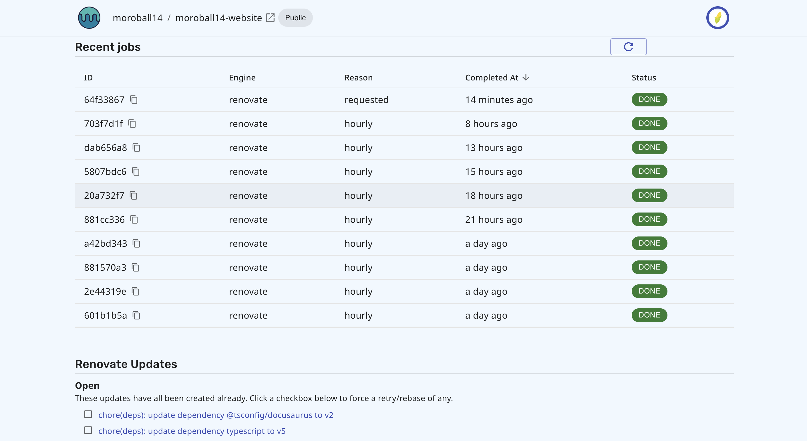

最近バージョンアップおじさんとして過ごしていたけど、そういえばそもそもバージョンアップしやすいような土台を作ってはいないなと思い、 Renovate の導入をこの個人サイトプロジェクトに導入してみた。

<!--truncate-->

## Renovate とは

依存関係を自動でアップデートしてくれるツール。

https://github.com/renovatebot/renovate

英語で renovate とは、何かに対して以前の良い状態に戻すために修理や改良を加えること、という意味らしい。

ref: https://jp.berlitz.com/wm/09atwork/1002.htm

## 依存関係を自動でアップデートすることの良さ

セキュリティホールの修正など、認識しやすいメリットがあることはもちろんだが、それ以上に後回しにしがちな作業を自動化することが嬉しいのでは？と思う。

依存関係を最新に保ち続けることで、何か新しい技術を導入したいとなっても障壁は少なくなるだろう。
必要になった時に行うという方針を取るチームもいるかもしれないが、ではいざその時が来たとなった時にスケジュールの猶予がある保証はどこにもない。

そう考えると、依存関係を最新に保ち続けることは、いざという時のためのリスクヘッジにもなると個人的には考えている。

でもいざやるとなると地味に労力のいる作業。実際に Node.js18 へのアップデート対応してわかった（笑）。
だから自動化できるならしたい。

業務で依存関係のバージョンアップをひたすら行う時期があったが、そういえばそもそもバージョンアップしやすいような土台を作ってはいない。なのでやってみる。
今回は Renovate を使って自動化してみる。

## 導入

https://github.com/renovatebot/renovate#github

にもあるとおり、GitHub のアプリをインストールするだけで導入できる。

ページに遷移して、Configure を押すと設定が始まる。
個人が install した GitHub Apps のページに現れる Renovate のページに遷移するので、そこで Renovate の App に対してアクセスできる権限を与えるリポジトリを選択する。

その後は Renovate のページにもあるとおり、Configure Renovate というタイトルで PR が作成される。

これは、Renovate の設定ファイルを作成するための PR で、この PR をマージすると Renovate の設定ファイルが作成される。

その後は Renovate がその設定ファイルに沿って、依存関係のバージョンアップを行ってくれる。

- どれくらいの頻度か
- メジャー、マイナー、パッチそれぞれの有効/無効
- レビュワー
- ラベル
- etc

など様々な設定が存在する。以下のページに全て書いてある。

https://docs.renovatebot.com/configuration-options/

Renovate のジョブを確認したい場合は、 `https://developer.mend.io/github/<ユーザー名>/<リポジトリ名>` にアクセスすると良い。ここでは、最近実行されたジョブや今アップデートしている依存関係などが確認できる。

## まとめ

GitHub App をインストールをして設定を変更するだけで、Renovate を導入することができた。
おそらく企業で導入するとなるともう少し手間はかかるだろうが、それでもこのセットアップの工数で仕組みを整えることができるのはかなり嬉しい。

ここでは観点として上がってこなかったが、バージョンを最新に保つためには、後方互換性を担保するためのソースコード上の工夫がそれなりに必要だ。

ライブラリに依存するコードは最小限にとどめ、使う API に関してはテストを書いておくなどは、今後楽にバージョンアップしていく上で対策しておきたい。
