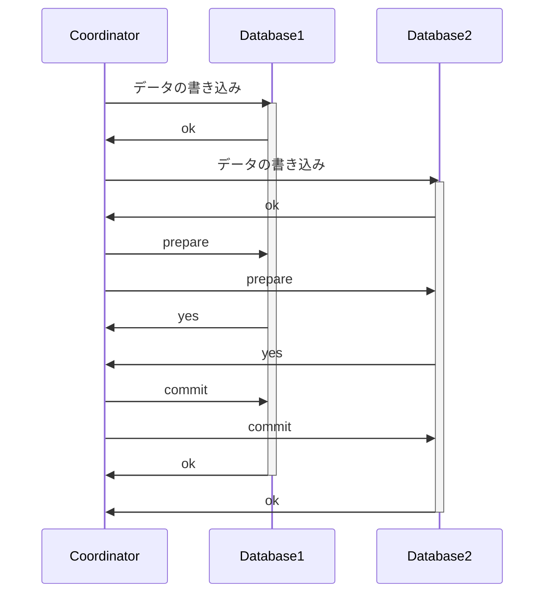
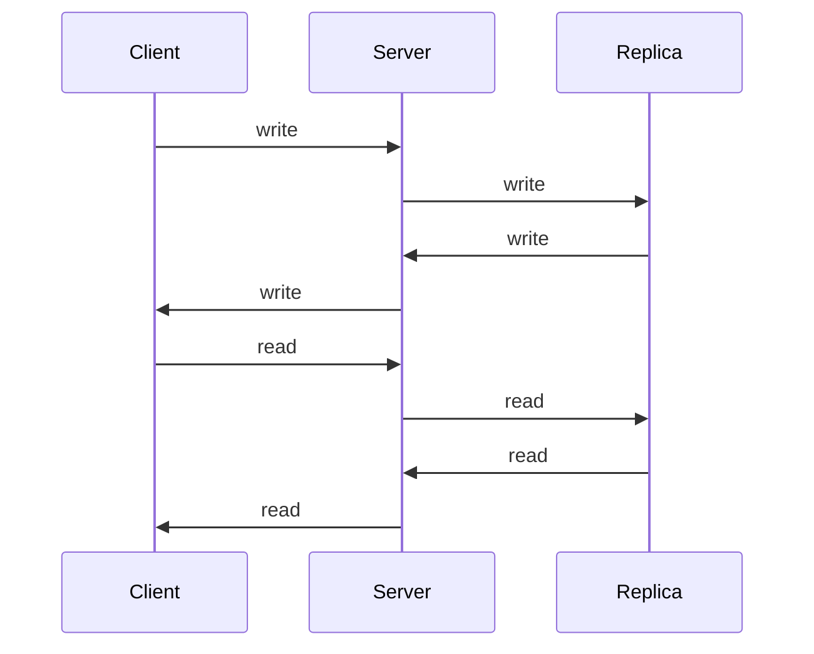

『[データベース指向アプリケーションデザイン](https://www.oreilly.co.jp/books/9784873118703/)』の 9 章「一貫性と合意」を読んだのでそのメモ

<!--truncate-->

> 耐障害性（fault-tolerance）を持つ分散システムを構築するためのアルゴリズムとプロトコルの例について論じます。

やはり世の中はアルゴリズム。

> アプリケーションが分散システムにおける問題のいくつかを無視できるようにしてくれる抽象概念を探していきます
> 分散システムにおける最も重要な抽象概念の一つに合意（consensus）

並行性にとってのトランザクション、分散システムにとっての合意。

## 9.1 一貫性の保証

> データシステムが提供しうるもっと強い一貫性モデルを調べていきます

気になるねー。結果整合性は、弱い一貫性モデルの一つ、とみなされているのは知らなかった。

## 9.2 線形化可能性

> 線形化可能性を持つシステムでは、
> データのコピーが一つしかないように見せかけるということは、読み取られる値が最新の値であり、古くなったキャッシュやレプリカからの値ではないことを保証する
> 言い換えれば線形化可能性とは最新性の保証

**9.2.1 システムを線形化可能にする条件は？**

> すべてのリクエストとレスポンスのタイミングを記録して、それらが適切な順序に並べられるかを調べれば、あるシステムの振る舞いが線形化可能になっているかをテストできます（ただしその演算負荷は大きくなります）

そうだよなー。これって相当な演算負荷になるよなー。そもそも大量のデータセットが前提での話だもんね。

**9.2.3 線形化可能なシステムの実装**

おー、このタイトルということは、いよいよアルゴリズムの話題に入ってくるのかな。

> 厳密なクオラムの読み書きは、線形化可能になるはず

厳密なクオラムってなんだっけ？図を見る限り、複数のレプリカから読み取りを行い、新しい値の方を受け取ること？

> クオラムの条件(w + r > n)

w は書き込みの数、r は読み取りの数、n はレプリカの数、ということだった。

> レース条件

並行性の問題、という意味だった。

**9.2.4 線形化可能にすることによるコスト**

> アプリケーションに線形化可能性が必須
> 一部のレプリカが他のレプリカからネットワークの問題で切り離されてしまったら、切り離されている状態のレプリカはリクエストを処理できない
> ネットワークの問題が解消されるのを待つか、エラーを返す

> アプリケーションにとって線形化可能性が必須ではない
> レプリカが切り離されている間は、リクエストを処理できない代わりに、エラーを返さずに古い値を返す

トレードオフだねー。
CAP 定理の話が最初に出てくるけど、どこにコストの要素があるのだろう

> 線形化可能性を持っているシステムは驚くほど少数

たとえばどんなシステムが線形化可能性を持っているんだろう

> 線形化可能性を切り捨てる理由はパフォーマンスであり、耐障害性ではない

## 9.3 順序の保証

> 全順序があれば任意の 2 つの要素を比較できるので、2 つの要素の大小は必ず判断できます

実数や整数、文字列の集合であればそれぞれの要素が比較できるため、全順序が成り立つ。
逆に集合同士などは大小の判断がつかないので全順序ではない。

全順序の概念難しい。

線形化可能なデータストアにおいては、並行する操作というものは存在しない。それはなぜならすべての操作は単一の時系列に沿って全順序が決まるから。
順序が定まると、線形化可能性が成り立つ、は理解できるから、ここで全順序という単語をチョイスしたのかな？
Git のような分散バージョン管理システムは、全順序が成り立たないので、線形化可能性が成り立たない。

> 因果律
> 2 つの出来事に因果関係があるなら、それらの間には順序関係があることになりますが、それらが並行に行われているなら比較不能
> 因果律は全順序ではなく半順序を定義する

シーケンス番号といったイベントの順序づけを定義する概念を用いて、半順序を定義する因果律に全順序を持たせる渡河の対策が本書に書いてある。
因果律も難しい。

**9.3.3 全順序のブロードキャスト**

> タイムスタンプによる順序づけをユニーク性の実装に使うなら、障害に対する耐性が全くなくなってしまう

ってあるから、「全順序のブロードキャスト」という章に移るが、全順序のブロードキャストとは何か？
この章、図解が少ないのでちょっと気力が続かない。。（笑）
そもそもブロードキャストとは、

> 同じネットワークにいる全員に対して同じ内容を送り付けること

> ref: https://wa3.i-3-i.info/word17.html

ということ。分散システムにおける問題というテーマだから、ブロードキャストの話は必要になるのだろう。

> 9.3.3.2 全順序ブロードキャストを利用した線形化可能なストレージの実装
> 9.3.3.3 線形化可能なストレージを使った全順序ブロードキャストの実装

とあり、ここに実装する際の話が書いてあるので、一旦インデックスを脳内に貼っておくだけにとどめる。

## 9.4 分散トランザクションと合意

> ノード群の合意を取ることが重要な状況は数多く
> リーダー選出
> アトミックなコミット

リーダー選出は、シングルリーダーレプリケーションのデータベースでは、リーダーになっているのがどのノードなのかということについて、すべてのノードが同意しておく必要がある。リーダーが 2 つあれば、それらがどちらも書き込みを受け付けてデータに差異が生じ、一貫性が損なわれたり、データが失われたりすることにつながる

アトミックなコミットは、トランザクションが一部のノードで失敗し、他のノードで成功するかもしれない、という問題がある。なので、すべてのノードがロールバックするか、すべてのノードがコミットするか、しなければいけない。

> 2 相コミットは、複数のノードにまたがるアトミックなトランザクションを実現するためのアルゴリズム

2 相コミットの図は以下のような感じ

この最初のデータの書き込み、という部分でロックを取得しているって認識であっているかな？

> 結婚式に例えれば、「はい」という前の時点なら新郎や新婦は「嫌だ」ということによってトランザクションを中断する自由がある
> 一旦「はい」と言ってから失神してしまい、牧師が「これであなた方は夫婦になりました」と言ったのを聞いていなかったとしても、トランザクションがコミットされたという事実は変わりません
> 後になって意識を取り戻した際、自分が結婚したのかどうかはグローバルなトランザクション ID の状況を僕氏に尋ねるか、牧師が次にコミット要求をリトライしてくるかを待てばわかります

この例わかりやすい。
ここでいう新郎や新婦はデータベース 1 とか 2 にあたり、分散トランザクションでは「参加者」と表現される。
牧師は、データの変更を要求した人にあたり、分散トランザクションでは「コーディネーター」と表現される。

> コーディネータはコミット要求をデータベース 1 に送信する直前にクラッシュ
> 2PC を完結させる唯一の方法は、コーディネータのリカバリを待つこと
> これがコーディネータが自身のコミットもしくは中断の判断をまずディスク上のトランザクションログに書き込み、参加者へコミットや中断のリクエストを送信するのはその後にしなければならない理由

ほーなるほどなー。理解した。用語整理するのやっぱ大事。

**9.4.2 分散トランザクションの実際**

> 多くのクラウドサービスは、分散トランザクションが引き起こす運用の問題のため、分散トランザクションを実装しないという選択をしています

なるほど。。運用を考えると、分散トランザクションは難しいのか。
まあ確かにパフォーマンス上の問題とかは容易に起こりそう。

> データベース内部の分散トランザクション
> ヘテロジニアスな分散トランザクション

前者は、データベースのノード間にまたがる内部的なトランザクションの話。後者は、参加者が 2 つ以上の異なる技術を利用している（たとえばベンダーが違うとか）話。

後者は複数の参加者のデータシステム間の一貫性を保つという意味では問題を解決するが、コーディネータそのものが一種のデータベース（トランザクションの結果はコーディネータに保存される）ので、他のデータベースと同様に扱いをする必要がある。

## まとめ

線形化可能性とはこんな感じで、並行性の問題を解決するための概念?のような感じだった。

あと、この章までもそうだが、結構概念の話が多いので、一つ一つ言葉の定義をちゃんと理解しないと間違ってしまう。
