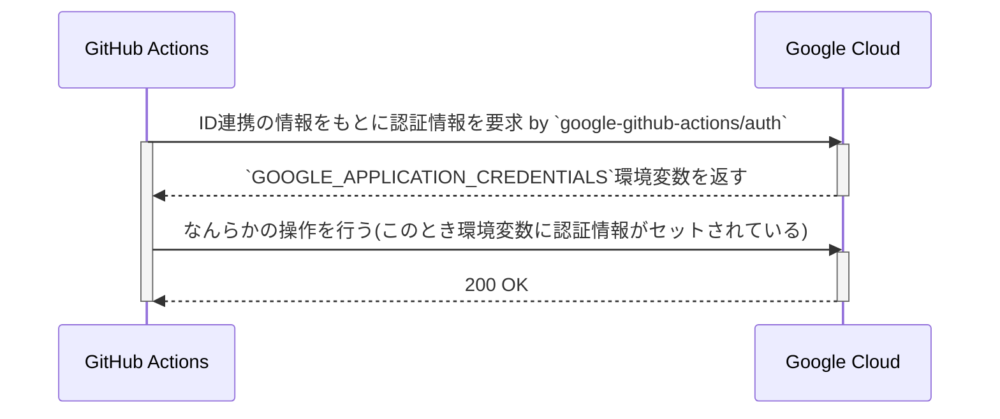

GitHub Actions から Google Cloud のリソースに対して操作を行うために認証の仕組みを整えているコードを会社で見つけた。

それが実現する背景にはどんな仕組みがあるのか、調べてみた。

<!--truncate-->

## Google での認証について

Google での認証について調べると、まずこのページから見た方が良さそう。

https://cloud.google.com/docs/authentication?hl=ja

このページではまずはじめに

> 認証とは、なんらかの認証情報を使用して ID を確認するプロセスです。認証とは自分の身元を証明することです。

とある。

Google が提供する多くの API とサービス、たとえば Google Maps Platform から提供されている API だったり、Cloud Run のような Google Cloud のサービスなどを利用する際に、認証が必要だ。

「アプリケーションから Google Cloud サービスに対する認証を行う」や「自分のローカル開発環境でいくつかの gcloud コマンドを試す」など目的に応じて、どの情報を参照すればいいかも、このページに載ってある。

また、ユースケースごとに適した認証方法を選択できるように、フローチャートが載っている。

正直自分はこのフローチャートを読んでも何すればわからなかったので結局そのページの補足を読むことにした（笑）。

会社で行っていた GitHub Actions から Google Cloud のリソースに対して操作を行う、というユースケースに沿った認証方法は、このフローチャートに則ると、

> ワークロードは Workload Identity 連携をサポートする外部 ID プロバイダで認証されますか？

> 「はい」の場合は、Workload Identity 連携を構成して、オンプレミスや他のクラウド プロバイダで実行されているアプリケーションがサービス アカウントを使用できるようにします

に該当しそうだ。

## Workload Identity 連携

ここでまた「Workload Identity 連携」という理解できていない単語が出てきたので、調べてみる。

https://cloud.google.com/iam/docs/workload-identity-federation?hl=ja

> ID 連携を使用することで、サービス アカウント キーを使用せずに、Google Cloud リソースへのアクセス権を、オンプレミスまたはマルチクラウドのワークロードに付与

とある。

この ID 連携が必要な理由にはこうある。

> Google Cloud の外部で実行されているアプリケーションは、サービス アカウント キーを使用して Google Cloud リソースにアクセスできます。ただし、サービス アカウント キーは強力な認証情報であり、正しく管理しなければセキュリティ上のリスクとなります

> ID 連携を使用すると、Identity and Access Management（IAM）を使用し、外部 ID に対して、サービス アカウントになりすます機能を含む IAM ロールを付与できます。これにより、サービス アカウント キーに関連するメンテナンスとセキュリティの負担がなくなります

ID 連携の仕組みを使えば、 **安全** に外部 ID に対してサービスアカウントと同等の権限を持った IAM ロールを付与できるってことか。

どうして、というところには一旦踏み込むのはやめて、構成方法を見てみる。GitHub Actions はデプロイメントパイプラインにあたるので、以下のページを参考にする。

https://cloud.google.com/iam/docs/workload-identity-federation-with-deployment-pipelines?hl=ja

基本的には Google Cloud 側での設定が必要になる。

- プロジェクトにおける、Workload Identity 連携に必要なサービスの有効化
- 属性のマッピングと条件を定義する
- Workload Identity のプールとプロバイダを作成する

デプロイパイプラインで認証するために、以下のことも行う。

- Google Cloud
  - デプロイパイプライン用のサービスアカウントを作成する
  - デプロイパイプラインによるサービスアカウントの権限借用を許可する
    - 表現が難しいが、Workload Identity プールへのアクセス権を付与するイメージっぽい
- GitHub
  - Actions ファイルで permission を追加する
  - `google-github-actions/auth` を使って、Google Cloud に対して認証するステップを追加する

これで Workload Identity 連携ができて、GitHub Actions から Google Cloud のリソースに対して操作を行うことができるようになる。

じゃあ、これでどうして Google Cloud のリソースに対して操作を行うことができるようになるのか、を理解するためには、Application Default Credentials についても理解する必要がありそう。

## Application Default Credentials

どうして自分がそう思ったかというと、`google-github-actions/auth` にこうあったから。

> If "create_credentials_file" is true, additional environment variables are exported:
> CLOUDSDK_AUTH_CREDENTIAL_FILE_OVERRIDE
> GOOGLE_APPLICATION_CREDENTIALS
> GOOGLE_GHA_CREDS_PATH

ref: https://github.com/google-github-actions/auth#other-inputs

実はまだ触れていなかったが、最初に見たページには認証の種類が載ってある。

https://cloud.google.com/docs/authentication?hl=ja#types

- OAuth 2.0
- Google Cloud サービスの認可
- アプリケーションのデフォルト認証情報

この三つ目の「アプリケーションのデフォルト認証情報」が Application Default Credentials だ。

> アプリケーション環境に基づいて認証情報を自動的に検索するために Google 認証ライブラリが使用する手法

> ADC を使用するには、コードを実行する場所に基づいて ADC に認証情報を提供する必要があります

とあり、まさに Workload Identity 連携にて認証情報を提供したばかりだ。

Application Default Credentials については、以下のページにも詳しく書いてある。

https://cloud.google.com/docs/authentication/application-default-credentials?hl=ja

検索の順序は、

- `GOOGLE_APPLICATION_CREDENTIALS`環境変数
- Google Cloud CLI で設定されたユーザー認証情報
- 接続済みのサービスアカウント

となっている。

ここまでで`GOOGLE_APPLICATION_CREDENTIALS`環境変数がセットされている。ドキュメントの説明にも、「Workload Identity 連携の認証情報構成ファイル」とある。

そのため、GitHub Actions から Google Cloud のリソースに対して操作を行うことができるようになる。設定部分は飛ばすが、Actions での挙動は以下のような感じだと思う。

<!-- ここまでの情報で、GitHub ActionsからGoogle Cloudのリソースを操作できるようになるまでをmermaidでシーケンス図を書く -->

## まとめ

- Google Cloud での認証について調べてみた
- GitHub Actions から Google Cloud のリソースに対して操作を行うためには、Workload Identity 連携を使う
- Workload Identity 連携を使うと、安全に外部 ID に対してサービスアカウントと同等の権限を持った IAM ロールを GitHub Actions のワークフローに付与できる
- その認証情報をもとに、GitHub Actions から Google Cloud のリソースに対して操作を行う

## その他

結構 Workload Identity 連携についての詳細は飛ばした。たとえば実際に構成していくときには Workload Identity プールとプロバイダといった概念と役割を理解する必要がある。それらも含めて解説している記事があるので、参考にすると良さそう。

- https://zenn.dev/cloud_ace/articles/7fe428ac4f25c8
- https://blog.lacolaco.net/2022/07/github-actions-oidc-google-cloud/

あとは、OAuth とかもちゃんと理解できていないので、そこらへんも調べてみたい。
